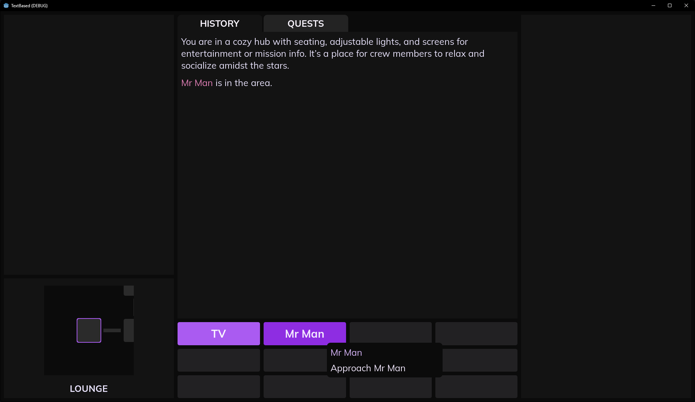

# TextBased

This is a text based/2D hybrid RPG built in godot. I want to eventually develop this into a complete game, but for now, I'm just building and designing the tools to make the game work.

**Dialogue and scenes**

The game uses dialogues, or scenes, as the main form of player input. These provide the player with options for what they want to do. When the player enters a room, they are given multiple options for each interactable person or object. These then begin their own scenes for the player to interact with such as dialogue.

Scenes can be used for character dialogues, item interaction such as picking up an item off the ground, environment interactions like a staircase or elevator, and even as time skips such as flashbacks. The system is very flexible.

When a scene path ends, the player is brought back to the "hub" of options where they can choose more to interact with or exit.

**Map and movement**

This is a text based "hybrid" in that the player moves in 2D spaces using WASD, but most of the game info is shown via text display. Rooms are designated by "cells" and are automatically linked by the game to create walkable pathways. The game supports bidirectional, one way, and keyed room connections.

Floors can lead to other floors through the use of scenes. A player can access an elevator and choose to go up or down, same with stairs or any other form of transport. The system is limitless.

**Quests**

The game has a quest system with branching storylines that work with the dialogue/scene system to change with the player's decisions. The game utilizes state flags for player quest progress, world event, and item tracking. In the game scenes/dialogues, a player scene can request info about the player and give context specific dialogue options or responses.

Scenes can be found in [the scenes folder.](story/scenes)
